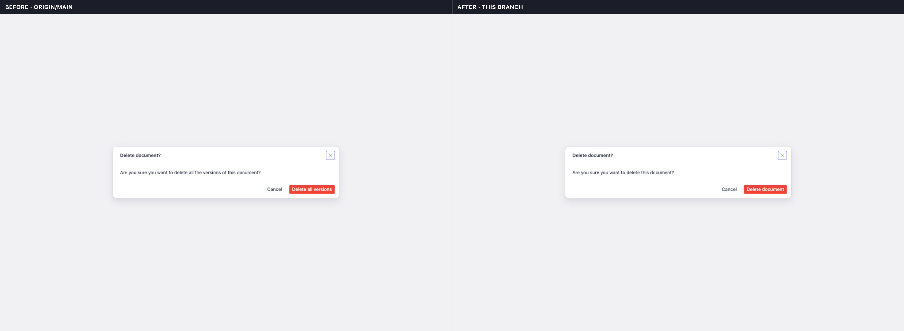
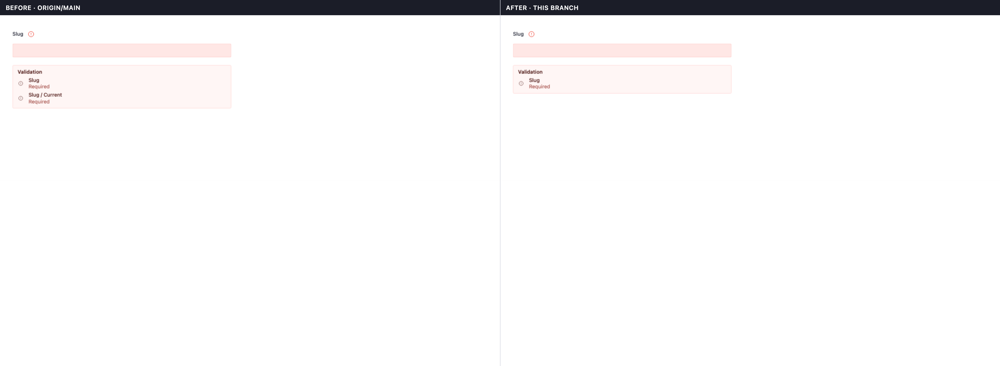
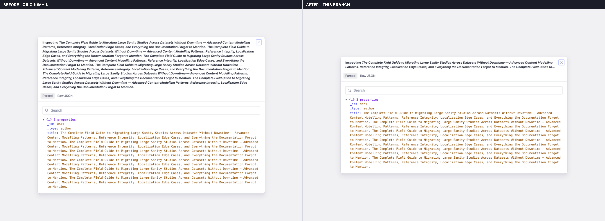

<div align="center">

# prshot

### Before/after PR screenshots with almost no overhead.

[](./LICENSE)
[](https://nodejs.org)
[](#contributing)


**One command. Real headless render. A labelled side‑by‑side your reviewer actually trusts.**



</div>

---

## The problem

You changed one line of copy in a dialog. Or tightened a margin. Or fixed an
overflow. The diff is trivially correct — but a reviewer can't _see_ it. So one
of two bad things happens:

- They spin up the **whole app** — auth, seed data, the right route, the right
  state — just to eyeball a single component. Minutes of overhead per review.
- They don't, and they approve on **"trust me, I tested it"** — the weakest form
  of PR evidence there is.

Visual regression services (Chromatic, Percy) solve this, but they're a
**hosted service**: a new account, a new bill, a new CI integration, and your
screenshots living on someone else's infrastructure.

**prshot** gives you the screenshot — both frames, before and after, labelled and
stitched — from **one local command**, using a browser you already have. No
service, no account, no new infra. It drops straight onto the PR.

## How it works (the trick)

prshot doesn't know about your framework. It owns the *orchestration*; **you**
own the *rendering* via a single capture command. The integration surface is one
environment variable.

```
        you supply  ──►  --capture "<cmd that writes a PNG to $EVIDENCE_OUT>"

  prshot then does, automatically:

   1. run capture on your branch ........................ AFTER frame
   2. git checkout the PR's changed *source* from base .. (revert just those files)
   3. run the SAME capture again ........................ BEFORE frame
   4. restore your working tree ......................... (always, even on error)
   5. stitch  BEFORE | AFTER  into one labelled PNG ..... via Playwright
   6. (optional) host it + post a PR comment ............ via the gh CLI
```

Because step 2 reverts only the source files the PR touches — and leaves your
capture story on `HEAD` — the **same** story renders against both refs. That's
what makes the two frames directly comparable.

## Quick start (30 seconds)

```bash
# install prshot + a browser for stitching (prshot doesn't bundle one)
npm i -D prshot playwright
npx playwright install chromium

# generate before/after for the current PR
npx prshot --capture "node capture.mjs" --base origin/main
# → .prshot/<branch>.png
```

Your `capture.mjs` can be anything that screenshots to `$EVIDENCE_OUT`:

```js
// capture.mjs — plain Playwright
import {chromium} from 'playwright'
const browser = await chromium.launch()
const page = await browser.newPage()
await page.goto('http://localhost:3000/components/button')
await page.locator('.my-button').screenshot({path: process.env.EVIDENCE_OUT})
await browser.close()
```

Post it straight to the PR (hosts the image on an assets branch + comments):

```bash
npx prshot --capture "node capture.mjs" --pr 123
```

> GitHub has no image‑upload API for comments, so prshot commits the PNG to a
> dedicated `prshot-assets` branch (via the Contents API, using your existing
> `gh` auth) and embeds its raw URL — which renders inline. That branch keeps
> screenshots out of code branches and CI, and is safe to delete anytime.

## Works with anything that can screenshot

The capture command is the entire integration. If your tool can write a PNG to a
path, prshot can drive it:

- **vitest browser mode** (`vitest-browser-react` + Playwright) — see
  [`examples/vitest-browser`](./examples/vitest-browser)
- **plain Playwright** — see [`examples/playwright`](./examples/playwright)
- **Cypress** (`cy.screenshot`), **Puppeteer**, **Storybook test‑runner**, …

```bash
# vitest-browser
prshot --capture "vitest run -c vitest.evidence.config.mts Dialog.evidence.tsx"

# single-frame prop-toggle variant (no base checkout)
prshot --no-base --capture "node capture-variants.mjs" --name button-states
```

## Animated before / after GIFs (`--gif`)

Some changes are about _behaviour_, not a single frame: a toggle that flips, an
error that clears as you type, a button whose destructive copy you softened. A
still can't show the interaction. `--gif` captures the change **in motion** —
and stitches before / after into one looping, side-by-side GIF.


```bash
# ffmpeg is required for GIF assembly (one-time)
brew install ffmpeg            # macOS  (sudo apt install ffmpeg on Debian/Ubuntu)

# before/after GIF for the current PR  → .prshot/<branch>.gif
prshot --gif --capture "node capture-frames.mjs" --base origin/main
```

### The frame contract

In `--gif` mode the capture command emits a **sequence of frames** instead of one
screenshot. prshot signals this with two env vars and otherwise keeps the same
tiny integration surface:

| Env var                       | Static mode    | `--gif` mode             |
| ----------------------------- | -------------- | ------------------------ |
| `PRSHOT_GIF`                  | _(unset)_      | `1`                      |
| `EVIDENCE_OUT` / `PRSHOT_OUT` | a PNG **file** | a frames **directory**   |

Your story writes `frame-000.png`, `frame-001.png`, … (zero-padded, in order)
into that directory. prshot runs it once on your branch (after), checks out the
PR's changed source from the base ref, runs it again (before), restores your
tree, and assembles a side-by-side GIF — left = before, right = after, each under
a colored bar (red / green) with a divider. Pass `--no-base` for a single GIF.

> The **static contract is unchanged**: without `--gif`, `EVIDENCE_OUT` is still a
> single PNG path and `PRSHOT_GIF` is unset. `--gif` is purely additive.

### The cursor helper (`prshot/cursor`)

A GIF reads best when the viewer can _see the interaction_ — a pointer gliding to
the thing that changed, a click, then the result. The browser's real cursor isn't
captured in screenshots, so prshot ships a small, dependency-free helper that
injects an SVG pointer and animates it. Import it from `prshot/cursor`:

```js
import {page, userEvent} from 'vitest/browser'
import {centerOf, clickPulse, glide, injectCursor, makeShooter} from 'prshot/cursor'

const dir = process.env.EVIDENCE_OUT // a directory in --gif mode
const shot = makeShooter(dir, (path) => page.screenshot({path}))
const cursor = injectCursor()

await glide(cursor, centerOf(button), 16, shot) // glide the pointer in, frame per step
await clickPulse(cursor, shot) //                   show a click ripple
await userEvent.click(button) //                    fire the REAL interaction
await shot() //                                     capture the resulting state
```

The pattern is always **glide → clickPulse → real click → capture frames** (then
optionally glide the pointer away so the result is unobscured, and hold a few
frames so the loop reads). See [`examples/playwright-gif`](./examples/playwright-gif)
for a complete, runnable capture command.

### GIF knobs

```bash
prshot --gif --capture "node capture-frames.mjs" \
  --fps 14 \             # output frame rate                       (default 14)
  --gif-scale 1040 \     # output width in px (820 single / 1040 side-by-side)
  --crop 900:600:60:40   # optional ffmpeg crop W:H:X:Y per input frame
```

> GIF assembly uses **ffmpeg on your PATH** (`brew install ffmpeg`). The ffmpeg
> bundled with Playwright is video-only and won't work — prshot needs a full
> system ffmpeg (image2 demuxer + pad/hstack). If ffmpeg lives somewhere unusual,
> point `$FFMPEG_PATH` at it. prshot checks for ffmpeg up front and fails with an
> actionable message if it's missing.

## Writing good evidence

> **The captured frame must show the subject _in context_ so a non‑implementer
> understands the change at a glance.**

This is the single most important habit. A screenshot of a bare `<button>` on a
white void proves nothing. A screenshot of that button **inside its dialog, with
the surrounding copy and the other actions visible**, tells the whole story —
which is exactly why the hero images below land.

- Render enough surrounding UI that the change reads on its own.
- Let animations and fonts settle before the screenshot (a ~500ms wait is plenty)
  so before/after frames line up pixel‑for‑pixel.
- For **API changes** that won't compile against the base ref, don't rely on the
  checkout: render the before and after states **in one frame** and pass
  `--no-base`.

### More real examples

A duplicate‑validation fix — two identical "Required" errors collapse to one,
with the offending field shown so the fix is unmistakable:



A long title that used to overflow the dialog header, now clamped:



## CLI reference

```
prshot --capture "<command>" [options]

  --capture <cmd>       Command that writes a PNG to $EVIDENCE_OUT  (required)
  --base <ref>          Base ref for the "before" frame             (default: origin/main)
  --no-base             Single-frame capture (no base checkout)
  --name <slug>         Output slug / file name                     (default: branch name)
  --source <glob>       Limit which changed files get reverted      (repeatable, comma-ok)
  --include-tests       Don't exclude test/story files from the revert set
  --out <dir>           Output directory                            (default: .prshot)
  --pr <number>         Host on an assets branch + post a PR comment (needs gh CLI)
  --assets-branch <b>   Branch used to host images                  (default: prshot-assets)
  --label-before <s>    Override the left column label
  --label-after <s>     Override the right column label
  --viewport <WxH>      Stitch canvas width hint                    (default: 2100x1200)
  --open                Open the result when done (macOS)
  -h, --help            Show help

  # GIF mode (animated before/after) — needs ffmpeg on PATH
  --gif                 Produce an animated GIF instead of a static PNG
  --fps <n>             Output frame rate                           (default: 14)
  --gif-scale <px>      Output width in px (820 single / 1040 side-by-side)
  --crop <W:H:X:Y>      Optional ffmpeg crop on every input frame
```

By default prshot reverts **all changed tracked files** between `<base>...HEAD`,
excluding test/story files (`*.test.*`, `*.spec.*`, `*.stories.*`,
`*.evidence.*`, `*.cy.*`, `__tests__/`, `__mocks__/`, `e2e/`) and files that
don't exist on the base ref (so a checkout reverts rather than deletes). Scope it
with `--source` in a monorepo.

## Limitations (honest)

- **Works best for behaviour / markup / style changes** with a **stable component
  API across refs** — the capture story must compile and render against both the
  base ref and your branch.
- For changes that rename props, change a signature, or otherwise break the story
  on the base ref, use a **prop‑toggle variant** that renders both states in one
  frame and pass `--no-base`.
- The PR branch must have whatever your capture command needs (e.g. browser‑test
  deps) installed and working — i.e. be reasonably current with the base ref.
- Stitching needs **Playwright** available (an optional peer dependency). prshot
  deliberately does **not** bundle a browser.
- `--gif` additionally needs a **system ffmpeg** on PATH (`brew install ffmpeg`).
  The static PNG path does not.
- `--pr` needs the authenticated [`gh` CLI](https://cli.github.com/).

## prshot vs. the alternatives

|                          | **prshot**                  | Chromatic / Percy        | Storybook test‑runner    | Manual screenshots        |
| ------------------------ | --------------------------- | ------------------------ | ------------------------ | ------------------------- |
| Before **and** after     | ✅ automatic from git refs  | ✅ (against a baseline)  | ⚠️ you wire it up        | ⚠️ you take two by hand   |
| Runs locally / offline   | ✅                          | ❌ hosted service        | ✅                       | ✅                        |
| Cost / account / infra   | **none**                    | paid service + account   | none                     | none                      |
| Screenshots live where?  | your repo / a git branch    | their servers            | your CI artifacts        | wherever you drop them    |
| Posts to the PR          | ✅ `--pr`                   | ✅ (via their app)       | ❌                       | ⚠️ drag‑and‑drop          |
| Framework lock‑in        | **none** (any capture cmd)  | their SDK                | Storybook                | none                      |

prshot isn't trying to replace a full visual‑regression service with diffing,
baselines, and review workflows. It does **one** thing: produce a trustworthy
before/after image for a single PR, locally, for free, with no new infra — the
90% case that those services are overkill for.

## Contributing

Issues and PRs welcome. The code is plain Node ESM with no runtime dependencies
(Playwright is an optional peer; ffmpeg is only needed for `--gif`). Start at
[`src/index.mjs`](./src/index.mjs) — the orchestrator — and follow it through
`capture` → `sources` → `stitch` → `github` for the static path, or
`capture` → `gif` for the `--gif` path. The optional injected-pointer helper
lives in [`src/cursor.mjs`](./src/cursor.mjs).

## License

[MIT](./LICENSE) © 2026 Eoin Falconer
